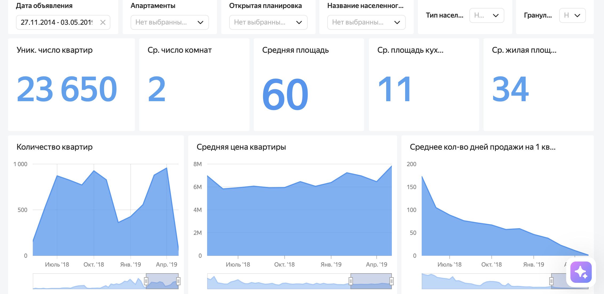
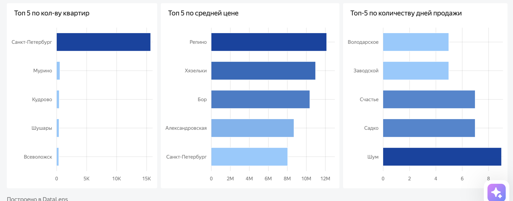
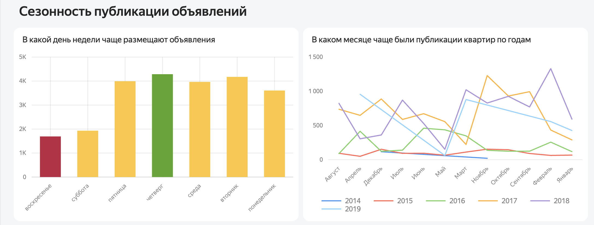
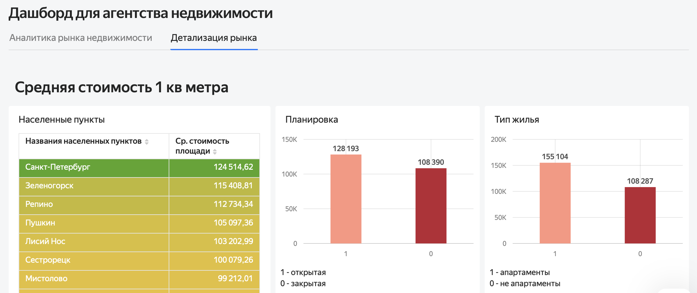
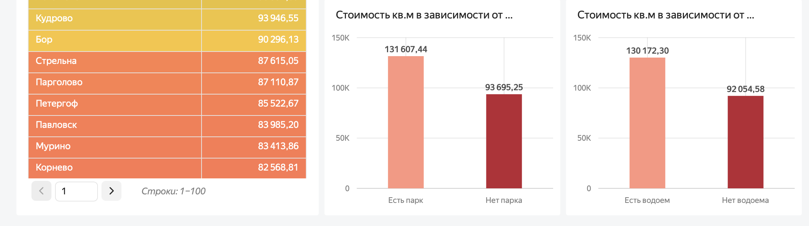

# Анализ рынка недвижимости Санкт-Петербурга и Ленинградской области

**Стек:** PostgreSQL · Yandex DataLens

### 🔗 [Открыть интерактивный дашборд](https://datalens.yandex/jc9bdgxsme0m3)



---

## Описание проекта
В рамках проекта проведён сравнительный анализ рынка жилой недвижимости Санкт-Петербурга и Ленинградской области за четыре года.
## Цель
Изучить ключевые характеристики рынка недвижимости, выявить различия между регионами,
определить наиболее востребованные сегменты жилья и проанализировать факторы,
влияющие на сроки продажи объектов.

## Задачи

- Проанализировать структуру и характеристики рынка недвижимости в двух регионах
- Рассчитать ключевые показатели стоимости и площади объектов
- Сравнить среднюю стоимость квадратного метра в Санкт-Петербурге и Ленинградской области
- Проанализировать сроки размещения и закрытия объявлений
- Выявить наиболее ликвидные сегменты недвижимости
- Исследовать сезонность публикации и закрытия объявлений
- Подготовить аналитический дашборд с основными показателями рынка

## Инструменты и техники

| Область | Что использовалось |
|---|---|
| SQL | CTE, `JOIN` |
| БД | PostgreSQL |
| Визуализация | Yandex DataLens |

## Результаты

- Средняя стоимость квадратного метра в Санкт-Петербурге примерно на **40 % выше**,
  чем в Ленинградской области
- Квартиры в Санкт-Петербурге в среднем имеют **большую площадь**
- Наиболее ликвидный сегмент рынка — **двухкомнатные квартиры площадью 50–60 м²**
- Более длительный срок размещения объявлений в Санкт-Петербурге связан
  с более высокой стоимостью объектов
- Выявлена сезонность рынка: пики публикации и закрытия объявлений приходятся
  на **октябрь — ноябрь**

## Дашборд

Две вкладки: **аналитика рынка** — динамика и топы по населённым пунктам,
**детализация рынка** — стоимость квадратного метра в разрезе факторов.
Фильтры: дата объявления, апартаменты, открытая планировка, населённый пункт,
тип населённого пункта, гранулярность.

### Аналитика рынка

Всего в выборке **23 650 квартир**. Типичный объект: 2 комнаты, 60 м² общей
площади, 34 м² жилой, 11 м² кухни.

**Топ-5 по разным метрикам** — лидеры не совпадают. По количеству квартир
Санкт-Петербург с огромным отрывом (около 15 тыс. против 500 у Мурино),
по средней цене вперёд выходят курортные посёлки Репино и Хязельки,
а Петербург оказывается лишь пятым.



**Сезонность.** Больше всего объявлений публикуют в четверг, меньше всего —
в воскресенье (1 692 против пика в 4,3 тыс.). Помесячная динамика различается
по годам, устойчивого сезонного пика нет.



### Детализация рынка

Средняя стоимость квадратного метра по населённым пунктам: Санкт-Петербург —
**124 515 ₽**, Зеленогорск — 115 409 ₽, Репино — 112 734 ₽.



**Что влияет на цену квадратного метра:**

| Фактор | Есть | Нет | Разница |
|---|---:|---:|---:|
| Парк рядом | 131 607 ₽ | 93 695 ₽ | **+40 %** |
| Водоём рядом | 130 172 ₽ | 92 054 ₽ | **+41 %** |
| Апартаменты | 155 104 ₽ | 108 287 ₽ | +43 % |
| Открытая планировка | 128 193 ₽ | 108 390 ₽ | +18 % |

Близость к парку или водоёму даёт к цене метра больше **40 %** — сопоставимо
с разницей между Петербургом и областью в целом. Для агентства это прямой
критерий отбора объектов.



## Структура репозитория

```
.
├── README.md
├── queries/
│   ├── 01_exploratory_analysis.sql   — разведочный анализ и границы выбросов
│   ├── 02_activity_by_region.sql     — задача 1: время активности объявлений
│   └── 03_seasonality.sql            — задача 2: сезонность публикаций
├── dashboard-overview.png         — ключевые показатели и динамика
├── dashboard-top5.png             — топ-5 населённых пунктов
├── dashboard-seasonality.png      — сезонность публикаций
├── dashboard-price-per-sqm.png    — стоимость метра по пунктам и типам
└── dashboard-price-factors.png    — влияние парка и водоёма на цену
```
